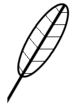

# Der Weg zur Bachelorarbeit

Hinweise zum Schreiben einer wissenschaftlichen Arbeit und zur Verwendung von Schreibprogrammen

**Endlich ist es soweit.** Du kannst Deine Abschlußarbeit schreiben.

Hm.. vielleicht ist es bei Dir schon seit einem Monat soweit - und es ist noch nichts passiert. Du bist nicht der erste, dem das passiert.

Wie kannst Du mit Deiner Arbeit vorwärtskommen?

Wir haben unsere Erfahrung aus zwei Doktorarbeiten, einem Haufen Fachpublikationen und einigen Büchern zusammengeworfen und die wichtigsten Punkte für Dich herausgearbeitet.

Wir wünschen Dir **viel Spaß beim Schreiben!**

## Kontakt

[krother@academis.eu](mailto:krother@academis.eu)

[www.academis.eu](http://www.academis.eu)

Weitere Lehrmaterialien zu verwandten Themen findest Du unter: [www.gitbook.com/@krother](www.gitbook.com/@krother)

## Lizenz

© 2015 Dr. Kristian Rother und Dr. Magdalena Rother

Veröffentlicht unter den Bedingungen der Creative Commons Namensnennungs-Lizenz 4.0.

Die Quellen zu diesem Text findest Du unter [https://github.com/krother/Der_Weg_zur_Bachelorarbeit](https://github.com/krother/Der_Weg_zur_Bachelorarbeit).

## Danksagungen

Wir danken Cornelius Frömmel und Janusz M. Bujnicki für wertvolle Hinweise beim Schreiben unserer Abschlußarbeiten. Wir danken Manuel Corpas für die Begutachtung von Teilen des Manuskripts zu diesem Manuskript.
