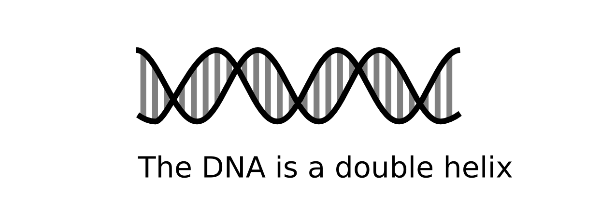

# Die Kernbotschaft

Im Jahr 1953 entdeckten Watson, Crick & Rosalind Franklin, daß die DNA eine Doppelhelix ist. Diese einfache Erkenntnis hat die biologische Forschung fundamental verändert. Es ist diese Einfachheit, die der Doppelhelix eine ungeheure Anziehungskraft als kulturelles Leitbild weit über die Biologie hinaus verleiht. Die Entdeckung der Doppelhelix hat eine einzelne klare Kernbotschaft. 

Genauso sollte jeder wissenschaftliche Text genau eine Kernbotschaft vermitteln.

In diesem Kapitel findest Du Drei Ansätze, die Dir beim Finden Deiner eigenen Kernbotschaft helfen.

## Eine Kernbotschaft auf einmal

Du kannst nur eine Aussage auf einmal verfolgen. Alles was Du außerdem hinzufügst, macht Deine Kernaussage zwangsläufig schwächer. Stelle Dir vor, die Struktur der DNA würde Dir folgendermaßen erklärt:

*"Die DNA ist eine Doppelhelix, und RNA macht manchmal auch Helices."*

**Kristian:** *Genau das ist mir bei meiner Doktorarbeit passiert. Ich habe mich ein Jahr lang damit herumgeqält, zwei Themen zusammenzuquetschen, obwohl die nichts miteinander zu tun hatten. Das Ergebnis war nicht so schön wie ich es mir gewünscht hätte."*

Bei einer Abschlußarbeit kommst Du normalerweise damit durch, wenn Du mehrere Kernbotschaften hintereinander beschreibst (auch wenn es nicht so schön ist). Bei anderen wissenschaftlichen Texten geht das nicht. Mehrere Kernbotschaften verwirren die Gutachter. Bei Fachartikeln kannst Du auf die Gutachten oft reagieren, aber wenn Du Forschungsgelder beantragst, bricht Dir die Mißachtung der *"Eine Aussage"*-Regel das Genick. Also suche Dir eine Kernbotschaft und bleib dabei.

## Die Kernbotschaft muß einfach sein

Eine gute Kernaussage darf nicht zu lang sein. Stelle Dir vor, die DNA würde der Welt folgendermaßen vorgestellt:

*"Die DNA ist ein Paar linearer Polymere aus Ribosen, die durch Phosphodiesterbrücken verbunden sind und an denen .."*

Ja, ich weiß, Wissenschaftler sind sehr intelligente Leute. Wir können unglaublich komplexe Sachverhalte verstehen, wenn es nötig ist. Meist ist es aber nicht nötig. Wir bevorzugen eine klare Aussage gegenüber einer, die wir erst entziffern müssen. Einfache Kernbotschaften sind klar.

Versuche einmal folgendes:

* Wie würdest Du Deine Arbeit in zehn Worten oder weniger zusammenfassen?
* Wie würdest Du Deine Arbeit einem Laien erklären?
* Wie würdest Du sie Deinen Eltern, Deinen Kindern erklären?

Wenn Du die Anzahl der Wörter begrenzt, mußt Du priorisieren. Was ist das wichtigste an Deiner Forschung? Vielleicht gelangst Du sogar dazu, daß wie bei der DNA die einfachere Kernbotschaft auch die schönere ist.

## Die Kernbotschaft zu finden macht Arbeit

Eine gute Kernbotschaft findet sich nicht alleine. Ein ebook über das Schreiben zu lesen und einen Satz mit zehn Wörtern aufzuschreiben reicht nicht. Wie kannst Du sichergehen, daß Du nicht zu stark vereinfachst? Was wenn Du noch gar nicht weißt, welcher Teil Deiner Arbeit der wichtigste ist? Was wenn Deine Daten komplex sind und Du sie noch nicht verstanden hast? Auch die Entdecker der DNA wahren an diesem Punkt, sie hatten einen Berg von Beobachtungen, den sie interpretieren und diskutieren mußten. Und das war ein Haufen Arbeit.

Genau darum geht es bei Wissenschaft. Schaue Dir Deine Beobachtungen an, überlege, diskutiere sie. Stelle Dich der Frage: *Was hat das alles zu bedeuten?* Alles nur, damit am Ende eine kurze Zusammenfassung, eine Schlußfolgerung, ein kleiner Tropfen Wissens herauskommt. Das ist nicht leicht. Aber wie ich oben schon gesagt habe: Wissenschaftler (auch Du) sind intelligente Leute. Setze Deine grauen Zellen in Bewegung und stelle Dich der Herausforderung.

## Zusammenfassung

Von **Edward Potworowski** haben wir gelernt, daß eine einfache Kernbotschaft (*One Simple Message*) das Fundament gelungener wissenschaftlicher Kommunikation ist. Um Deine Forschungsergebnisse zu vermitteln, mußt Du diese eine Botschaft finden, die einfach genug ist um verstanden zu werden, und korrekt genug um nützlich zu sein.

Hast Du die Kernbotschaft erst einmal gefunden, kannst Du daraus viel leichter lange und kurze Texte, Präsentationen, Poster oder Anträge für Forschungsgelder schreiben. Dann zahlt sich die Arbeit schnell aus.

Wie lautet Deine Kernbotschaft?

