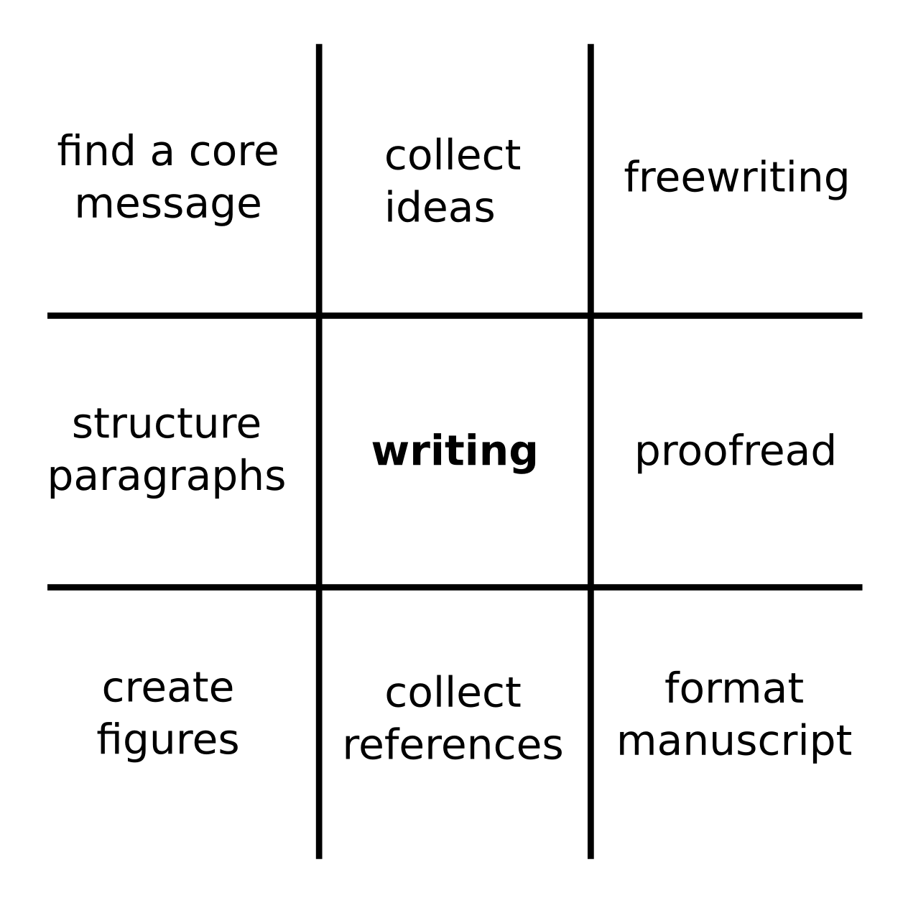

# Neun verschiedene Arten zu schreiben

**Kristian:** *"Als ich meinen ersten Fachartikel schrieb, dachte ich, Schreiben hieße vor einer Tastatur zu sitzen und zu tippen bis der Text fertig sei. Das funktionierte häufig *überhaupt nicht*, und das Ergebnis war eine solide Schreibblockade. Ich habe Jahre gebraucht, um zu verstehen, daß der Schreibprozess viel komplexer ist. Einen wissenschaftlichen Text zu verfassen erfordert viele verschiedene Tätigkeiten, und Tippen ist nur eine davon. 

Ich habe insgesamt neun gesammelt:

#### Finde die Kernbotschft

Was versuchst Du mit Deiner Arbeit, Deinem Kapitel, Deinem Absatz zu sagen. Viele Ratgeber zum Schreiben empfehlen nur eine Kernbotschaft auf einmal zu vermitteln. Wie würdest Du Deinen Text in eimen prägnanten Satz zusammenfassen?

#### Sammle Ideen

Um gute wissenschaftliche Texte zu schreiben, benötigst Du Rohmaterialien: Fakten, Beobachtungen, Zahlen, Referenzen. Dieses Rohmaterial zu sammeln bedeutet, daß Du Deine Notizen und Ergebnisse durchgehst und Literatur liest und dabei einzelne Punkte aufschreibst, die Du genauer ausführen könntest.

#### Freewriting

Freewriting ist eine Methode, um Text aus dem Nichts zu erschaffen. Stelle eine Stoppuhr auf 10 Minuten. Fange an zu schreiben. Höre nicht auf zu schreiben bevor die 10 Minuten um sind, auch nicht wenn Dir nur Müll einfällt. Freewriting bedeutet, daß Du eine Menge Müll schreiben wirst. Es ist normal unstrukturiert zu schreiben, bevor sich Deine Gedanken sortieren. Freewriting hilft Dir, diese unstrukturierte Phase schneller hinter Dir zu lassen.

#### Absätze strukturieren

Konstruiere Deinen Text nach dem Top Down Ansatz. Teile einen Textabschnitt in Absätze. Stelle für jeden Absatz eine Kernaussage und einige Hauptpunkte auf. Finde einen Einleitungs- und Schlußsatz. Dann nimm Dir den nächsten Absatz vor usw.

#### Schreiben

An der Tastatur zu sitzen und mit Sätzen und einzelnen Wörtern zu ringen gehört immer noch dazu, egal wie viele Schreibtechniken Du beherrschst. Sorge dafür daß Du in diesen Momenten ungestört bist, Deinen Lieblingskaffeebecher oder Deine Katze dabei hast und es genug Bleistifte zum Abknabbern gibt.

### Korrekturlesen

Wenn Dir irgend etwas an Qualität gelegen ist, kommst Du um intensives Korrekturlesen nicht herum. Lies Deinen Text. Editiere ihn. Lies ihn noch einmal, am Besten nach einer Pause. Überprüfe Rechtschreibung und Grammatik. Überprüfe den Textfluß von einem Absatz zum nächsten. Überprüfe die Fakten doppelt und dreifach.

Andere Leute sind oft bessere Korrekturleser als Du selbst, weil sie Deinen Text aus einem ähnlichen Abstand sehen können wie Deine Gutachter.

#### Abbildungen erstellen

Viele Wissenschaftler empfehlen, mit den Abbildungen anzufangen. Wenn Deine Abbildungen und Tabellen eine zusammenhängende Geschichte erzählen, ist der Text dazwischen viel einfacher zu schreiben. 

#### Referenzen sammeln

Man könnte sagen, daß das Schreiben in dem Moment anfängt, in dem Du Dich anfängst mit der Literatur zu beschäftigen. Fange an, einen Referenzmanager zu verwenden, sobald Du mehr als Drei Literaturstellen gesammelt hast. Es ist nicht wichtig, ob Du Mendeley, EndNote, BibTex oder einen Texteditor mit PMIDs verwendest. Alle vier Methoden können Dir viele Stunden entnervter Arbeit ersparen.

#### Formatieren des Manuskripts

Sorge dafür, daß Dein Manuskript gut aussieht und Du die Richtlinien der Zeitschrift oder Deines Prüfungsbüros akribisch befolgst. Normalerweise ist das Formatieren etwas für die Endphase, aber es ist nicht verkehrt, zwischendurch ab und zu aufzuräumen.

Du kannst Deine Zeit beim Schreiben mindestens auf diese neun Arten verbringen. Bevor Dein Manuskript fertig ist, wirst Du Dich mehrmals durch jedes Feld im Diagramm bewegen.

Das Diagramm ist auch ein Rezept gegen Schreibblockaden: Sobald Du merkst, daß was immer Du tust nicht so gut funktioniert, ist es höchste Zeit, zu einer anderen Tätigkeit im Diagramm zu wechseln.
