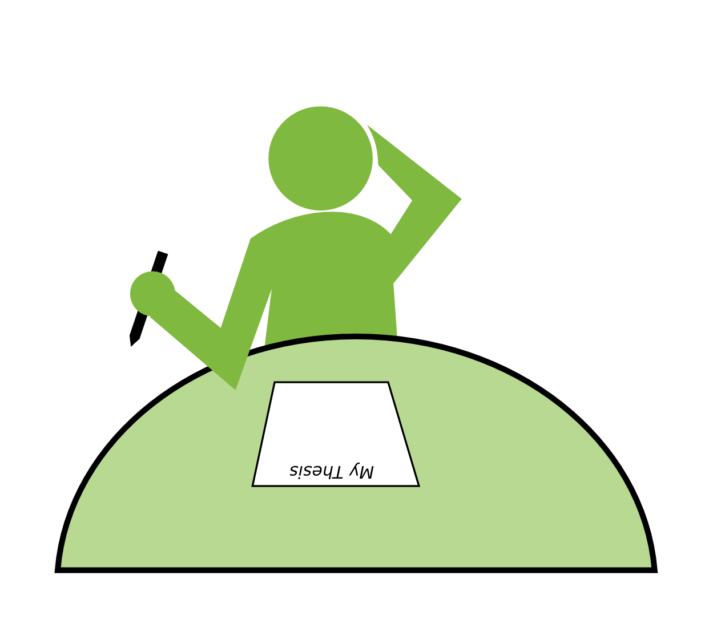

# Sechs sichere Wege, nie mit der Abschlußarbeit fertig zu werden

Der große Moment ist da: Du fängst an Deine Abschlußarbeit zu schreiben.

Moment mal.. *eigentlich* wartet die Arbeit schon einen Monat darauf, daß Du endlich anfängst. Du hast immer noch dieses leere Blatt vor Dir und einen veritablen Stapel Notizen auf Deinem Schreibtisch. Aber Deine Verteidigung ist immer noch eine Ewigkeit entfernt.

**Diese Anleitung hilft Dir dabei, daß es auch so bleibt.**

Wir haben unsere Erfahrung aus zwei Doktorarbeiten zusammengeworfen (was eine gute Annäherung der Ewigkeit ist). Um mit *Deiner* Abschlußarbeit niemals fertig zu werden, tue folgendes:

## 1. Setze Dir hohe Ziele

**„Diese Woche werde ich die ganze Einleitung schreiben.”**

Erstens ist eine Woche eine lange Zeit. Wenn Du statt heute erst morgen anfängst, hast Du immer noch so gut wie eine Woche übrig. So schaffst Du es bestimmt locker. Zweitens klingt *die ganze Einleitung* mutig genug. Ein langes Kapitel von 10 Seiten oder mehr zu schreiben, in dem Du Dein allgemeines und spezifisches Fachwissen darstellst, ist eigentlich fast schon lächerlich einfach. Es sei denn, Du verschiebst diese Aufgabe auf den St. Nimmerleinstag.

## 2. Schreibe als wäre es ein Vollzeitjob

**„Heute werde ich den ganzen Tag lang nur schreiben.”**

Für eine intelligente Person ist es leicht, Buchstaben in einen Computer zu hacken. Du kannst Dich sicherlich problemlos drei Stunden oder länger am Stück konzentrieren, besonders nach einem normalen Arbeitstag. Nimmst Du noch die Nacht dazu, kannst Du die drei auf acht Stunden ausdehnen. Jeder Mensch, besonders Du hast so viel Selbstdisziplin, daß Du Dich nicht ablenken läßt. Du möchtest nicht mit anderen Leuten sprechen, und Dein Mobiltelefon oder das Internet im Allgemeinen lenkt dich nicht ab. Du kannst ohne weiteres wie ein Mönch da sitzen und tippen, bis die Arbeit fertig ist.

## 3. Dein Fortschritt ist beliebig reproduzierbar

**„Gestern habe ich drei Seiten geschafft, das mache ich heute noch einmal.”**

Deine Aufgabe ist es, eine bestimmte Anzahl von Seiten zu produzieren. Eine Seite ist eine bestimmte Anzahl Zeilten, Wörter, Buchstaben. Du kannst also Deinen Fortschritt objektiv messen. Wenn Du an einem Tag eine bestimmte Menge Text schreibst, kannst Du am nächsten Tag genauso viel fertig bringen. Es kommt nicht darauf an, daß manche Seiten mit Abbildungen, Tabellen und Aufzählungen voll sind, und andere schwierige Gedankengänge beinhalten.

Um eine konstante Schreibgeschwindigkeit beizubehalten, ignoriere die Abbildungen bis zum Schluß. Schreibe einfach statt der Abbildung ein *TODO* oder *MACH ICH SPÄTER* in den Text. Du wirst Dich bestimmt kurz vor dem Abgabetermin daran erinnern, welche Abbildung wohin soll.

Es ist auch nicht wichtig, ob Du nach einem anspruchsvollen Stück Schreibarbeit innerlich erschöpft bist. Ein guter Student betrachtet sich eher als eine menschliche Erweiterung des Druckers, nicht umgekehrt.

## 4. Formatiere die Literaturreferenzen von Hand

**„Wer braucht schon Mendeley oder EndNote?”**

Nach mehreren Monaten oder Jahren kennst Du die Publikationen in Deinem Forschungsgebiet auswendig. Du kannst also die Referenzen einmal in Deine Arbeit einfügen und sie danach nicht mehr anrühren. Da Du Deine Arbeit in einem Rutsch vom Anfang bis zum Ende schreibst, wird es niemals vorkommen, daß Du Referenzen in die Einleitung oder Diskussion einfügen mußt. Falls doch, gilt das neu Formatieren des Literaturteils als eine gute Aufwärmübung, die Du am besten täglich durchführen solltest.

## 5. Drucke die Arbeit am letztmöglichen Termin aus

**„Einfach Strg-P drücken und das wars.”**

Jedes moderne Schreibprogramm beherrscht WYSIWYG - What You See is what You get. Was auf dem Bildschirm ist, sieht auf dem Papier genauso aus. Die zum Drucken nötige Zeit hängt ausschließlich von der Geschwindigkeit des Druckers ab. Überraschungen sind praktisch auszuschließen, vor allem folgende Dinge bereiten heutzutage nie Schwierigkeiten:

* Seitenränder
* Auflösung von Bildern
* Farben von Abbildungen
* Korrekte Querverweise im Text.

Wegen der hohen Qualität von Druckern ist es auch unnötig, das ausgedruckte Material von Hand zu prüfen. Technische Schwierigkeiten wie verschmierter Toner sind seit mindestens einem Jahrzehnt Geschichte. Auch das Personal im Copyshop ist für seine Professionalität bekannt und wird freundlich reagieren, wenn Du sie bittest, sechs Ausfertigungen Deiner Arbeit kurz vor Ladenschluß zu binden. Zusammengefaßt macht es keinen Unterschied ob Du einen Brief von einer Seite oder eine Doktorarbeit ausdruckst.

## 6. Bitte niemals um Hilfe

**„Kannst Du nicht sehen daß ich arbeite?”**

Im Gegensatz zu einem Nobelpreis kannst Du einen Doktor oder einen Bachelor mit niemandem teilen. Das bedeutet, daß Du nicht nur die Arbeit alleine schreiben mußt, sondern daß jegliche Unterstützung streng verboten ist. Das schließt auch aus, einen Mitstudenten Deine Arbeit auf Lesbarkeit, Rechtschreibung oder Struktur durchzusehen. Auch Motivation durch Deine Familie kann als Täuschungsversuch gewertet werden. Am Besten sprichst Du während der Schaffensperiode überhaupt nicht mit Deinem Betreuer. Du hast nämlich einige Überraschungen für ihn vorbereitet, die das ganze Forschungsgebiet aufrütteln werden.

Wenn Deine Freunde oder Kollegen in der Nähe sind und nach Deiner Abschlußarbeit fragen, möchten sie vermutlich Deine Ergebnisse stehlen. Oder sie sind neidisch auf Deinen baldigen Titel, der Dich zu einem besseren Menschen machen wird als die anderen es jemals sein können.

## Schlußfolgerung

Eine wissenschaftliche Abschlußarbeit zu schreiben ist der ultimative Test Deiner übermenschlichen Fähigkeiten. Nachdem Herkules den Stall des Augias ausgemistet hatte, fragte auch keiner, was eigentlich darin gewesen war. Mit einer wissenschaftlichen Arbeit ist es genauso: Das Volumen ist das einzige was zählt, Qualität wird überbewertet.

Oder ist das am Ende vielleicht doch keine so gute Idee?

Die obigen Anweisungen aufmerksam durchzulesen, bringt Dich dem Abschluß noch nicht näher. Aber vielleicht hast Du einige Ideen bekommen, wie Du das Werk eines Tages aus eigener Kraft vollenden kannst - oder zumindest die leere Seite vor Dir füllst.

#### Sicherheitshinweis

**Die obigen Hinweise sind nicht ernst gemeint. Sie sind als Warnung vor häufigen Fallen beim Schreiben gedacht.** 

So, jetzt habe ich hoffentlich verhindert, daß Du ziellos in Dein Verderben rennst ;-).
