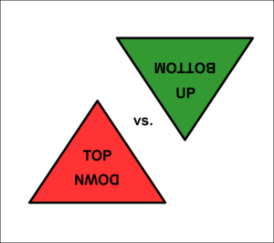

# Top Down vs. Bottom Up

Es gibt zwei grundlegende Strategien beim Schreiben:

## Die Top Down Strategie

Verwende das folgende Rezept:

1. Finde einen knackigen Titel oder Kerngedanken.
2. Identifiziere die 2-5 wichtigsten Unterpunkte.
3. Schreibe 2-3 Sätze zu jedem dem Unterpunkte.
4. Formuliere einen Einleitungs- und einen Schlussatz.
5. Falls das nicht reicht, wende die Top-Down Strategie auf jeden der Unterpunkte noch einmal an.

### Vorteile

* man ist gezwungen zu fokussieren.
* Ergebnis ist immer eine Struktur (auch wenn's dauern kann).
* die Struktur kann auch für Vorträge, Webseiten, etc. verwendet werden.

### Nachteile

* das Thema wird eingeschränkt.
* die Struktur ist schwer zu ändern.

## Die Bottom Up Strategie

Verwendet das folgende Rezept:

1. Sammle alles, was Dir spontan zu einem Thema einfällt als Stichpunkte.
2. Ordne Deine Stichpunkte. Falls etwas gar nicht passt, streiche es.
3. Schreibe Sätze zu jedem der Stichpunkte.
4. Formuliere einen Einleitungs- und Schlussatz.
5. Finde einen knackigen Titel.

### Vorteile

* es ist leicht, ein Thema vollständig abzudecken.
* man findet oft neue Verknüpfungen.
* Text lässt sich parallel zur experimentellen Arbeit entwickeln.

### Nachteile

* Redundanz entsteht.
* der Überblick geht leicht verloren.

## Strategie gegen Schreibblockaden: 

Wenn der Schreibfluss einmal längere Zeit ins Stocken gerät, hilft es oft, etwas anderes zu tun. Also die Strategie wechseln, von Top-down nach Bottom-up oder 
wieder zurück.
